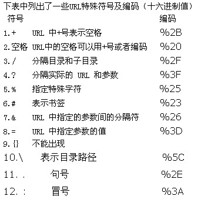

# 题目描述:

请实现一个函数，将一个字符串中的每个空格替换成“%20”。例如，当字符串为We Are Happy.则经过替换之后的字符串为We%20Are%20Happy。

在网络编程中，如果URL参数中含有特殊字符，如空格、'#'等，可能导致服务器端无法获得正确的参数值。我们需要将这些特殊符号转换成服务器可以识别的字符。转换的规则是在'%'后面跟上ASCII码的两位十六进制的表示。比如空格的ASCII码是32，即十六进制的0x20，因此空格被替换成"%20"。再比如'#'的ASCII码为35，即十六进制的0x23，它在URL中被替换为"%23"。
<!--more-->



# 解题思路:
 
1. 遍历添加法。
    新搞一个字符串res，从头到尾扫描字符串，每一次碰到空格字符的res添加字符串 "%20" ,否则添加字符。
    **时间复杂度**: O(n), **空间复杂度**: O(n)

2. 原地替换法
    a. 先遍历一次字符串，这样就能统计出字符串中空格的总数，并可以由此计算出替换之后的字符串的总长度。
    b. 从字符串的后面开始复制和替换。
    **时间复杂度**: O(n), **空间复杂度**: O(1)

## 代码

### 遍历添加法

```c++
class Solution {
public:
    string replaceSpace(string s) {     //字符数组
        string res;   //存储结果
        for(auto &c : s){   //遍历原字符串
            if(c == ' '){
                res.push_back('%');
                res.push_back('2');
                res.push_back('0');
            }
            else{
                res.push_back(c);
            }
        }
        return res;
    }
};
```

## 原地替换法

```c++
class Solution {
public:
    string replaceSpace(string s) {
        int n = s.size();
        int cnt = 0;
        for (int i = 0; i < n; i++) {
            if (s[i] == ' ') cnt++;
        }
        int len = (n + 2 * cnt); // 计算替换空格后的字符串的长度
        s.resize(len);
        // 当i < j 时说明是还有空格的，跳出循环的条件是i==j;
        for (int i = n - 1, j = len - 1; i < j; i--, j--) {
            if (s[i] != ' ') {
                s[j] = s[i];   
            } else {
                s[j] = '0';
                s[j-1] = '2';
                s[j-2] = '%';
                j-=2;
            }
        }
        return s;
    }
};
```
