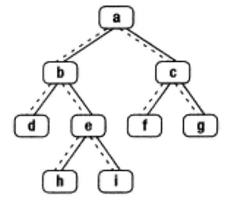

# 题目描述：
给定一个二叉树和其中的一个结点，请找出中序遍历顺序的下一个结点并且返回。注意，树中的结点不仅包含左右子结点，同时包含指向父结点的指针。
<!--more-->
# 本题考点：
  
  二叉树的中序遍历(LDR)，以及分情况讨论。
  
# 解题思路:


上图二叉树的中序遍历是d,b,h,e,i,a,f,c,g。

**情况1:** 

**如果一个结点有右子树，那么它的下一个结点就是它的右子树的最左子结点**。也就是说从右子结点出发一直沿着指向左子树结点的指针，我们就能找到它的下一个结点。例如，图中结点b的下一个结点是h，结点a的下一个结点是f。

**情况2:**

结点没有右子树的情形。**如果结点是它父结点的左子结点，那么它的下一个结点就是它的父结点**。例如，途中结点d的下一个结点是b，f的下一个结点是c。

**情况3:**

如果一个结点既没有右子树，并且它还是父结点的右子结点，这种情形就比较复杂。我们可以沿着指向父结点的指针一直向上遍历，**直到找到第一个当前节点是其父节点左孩子的节点**。例如，为了找到结点i的下一个结点，我们沿着指向父结点的指针向上遍历，先到达结点e。由于结点e是父结点b的右子结点，我们继续向上遍历到达结点b，b是父节点a的左子节点，所以节点a是i的下一节点。

# 代码

## C++
```c++
/*
struct TreeLinkNode {
    int val;
    struct TreeLinkNode *left;
    struct TreeLinkNode *right;
    struct TreeLinkNode *next;
    TreeLinkNode(int x) :val(x), left(NULL), right(NULL), next(NULL) {
        
    }
};
*/
class Solution {
public:
    TreeLinkNode* GetNext(TreeLinkNode* Node)
    {
        if (Node == nullptr) return nullptr;
        TreeLinkNode* res = nullptr;
        // 当前结点有右子树，那么它的下一个结点就是它的右子树中最左子结点
        if (Node->right != NULL) {
            TreeLinkNode* p = Node->right;
            while(p->left != NULL) {
                p = p->left;
            }
            res = p;
        }
        // 当前结点无右子树，则找第一个当前节点是父节点左孩子的节点
        else if (Node->next!=NULL) {
            TreeLinkNode* p = Node;
            while(p->next) { //找第一个当前节点是父节点左孩子的节点，返回其父节点
                if(p->next->left == p) return p->next;
                p = p->next;
            }
        }
        return nullptr; //退到了根节点仍没找到，则返回null
    }
};
```
## Python
```python
# -*- coding:utf-8 -*-
# class TreeLinkNode:
#     def __init__(self, x):
#         self.val = x
#         self.left = None
#         self.right = None
#         self.next = None
class Solution:
    def GetNext(self, Node):
        # write code here
        if Node is None:
            return None
        res = None
        if Node.right:
            pRight = Node.right
            while pRight.left:
                pRight = pRight.left
            res = pRight
        elif Node.next:
            pCur = Node
            pNext = Node.next
            while pNext and pNext.right == pCur:
                pCur = pNext
                pNext = pNext.next
            res = pNext
        return res
```

# 参考
[二叉树的下一个节点](http://www.leetcodecn.com/pages/3fc857/#%E9%A2%98%E7%9B%AE%E9%93%BE%E6%8E%A5)