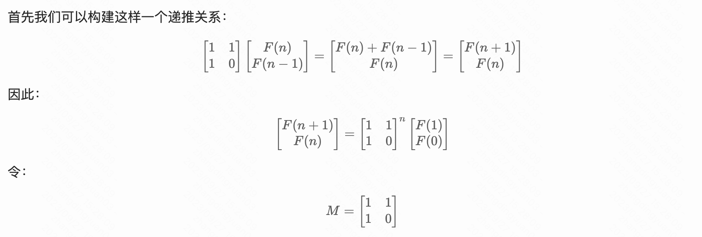

# 题目描述：
斐波那契数列，现在要求输入一个整数n，请你输出斐波那契数列的第n项（从0开始，第0项为0）。


<!--more-->

# 解题思路:
  1. 传统暴力递归，复杂较高，可以用记忆化递归优化，时间复杂度O(2<sup>n</sup>);
  2. 动态规划，只用前两个数计算节省空间，时间复杂度O(1);
  3. 矩阵快速幂，利用数学公式，时间复杂度O(log<sub>2</sub>n);

  
  
# 代码

## C++: 
###  暴力递归
```c++
class Solution {
public:
    int mod=1e9+7;
    int fib(int n) {
        if (n < 2) return n;
        return (fib(n-2) + fib(n-1)) % mod;
    }
};
```

### 记忆化搜索递归 
```c++
vector<int>ans(101,0);
class Solution {
public:
    int mod=1e9+7;
    //记忆化搜索
    int fib(int n) {
        if(n < 2) return n;
        if(ans[n] != 0) return ans[n];
        ans[n] = (fib(n-2)+fib(n-1)) % mod;
        return ans[n];
    }
};
```

### 动态规划
```c++
class Solution {
public:
    int mod = 1e9+7;
    int fib(int n) {
        if (n < 2) return n;
        int f = 0;
        int f_one = 1;
        int f_two = 0;
        for (int i = 2; i <= n; i++) {
            f = (f_two + f_one) % mod;
            f_two = f_one;
            f_one = f;
        }
        return f;
    }
};
```

### 矩阵快速幂

```c++
// 定义矩阵
typedef long long ll;
ll mod = 1e9 + 7;
struct matrix {
    ll mat[2][2];
    matrix() { memset(mat, 0, sizeof(mat)); }//构造函数初始化
};
class Solution {
public:
    matrix res, transition;
    //矩阵乘法
    matrix mul(matrix A, matrix B) {  // return A * B
        matrix C;
        for (int i = 0; i < 2; i++) {
            for (int j = 0; j < 2; j++) {
                for (int k = 0; k < 2; k++) {
                    C.mat[i][j] += (A.mat[i][k] % mod * B.mat[k][j] % mod) % mod;
                    C.mat[i][j] %= mod;
                }
            }
        }
        return C;
    }
    //快速幂
    void fast_pow(int n) {
        while (n) {
            if (n & 1) {
                res = mul(res, transition);
            }
            transition = mul(transition, transition);
            n >>= 1;
        }
    }

    int fib(int n) {
        if (n < 2) return n;
        //初始化
        res.mat[0][0] = 1;
        transition.mat[0][0] = transition.mat[0][1] = transition.mat[1][0] = 1;
        fast_pow(n - 1);
        return res.mat[0][0];
    }
};
```


# Python:
###  递归 未通过OJ
```python
# -*- coding:utf-8 -*-
class Solution:
    def Fibonacci(self, n):
        # write code here
        if n<2:
            return n
        return self.Fibonacci(n-1) + self.Fibonacci(n-2)
```
### 动态规划
```python
# -*- coding:utf-8 -*-
class Solution:
    def Fibonacci(self, n):
        # write code here
        if n<2:
            return n
        fn_one = 1
        fn_two = 0
        fn = 0
        for i in range(2,n+1):
            fn = fn_one + fn_two
            fn_two = fn_one
            fn_one = fn
        return fn
```
