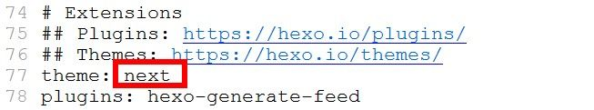
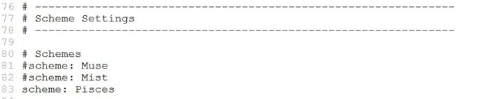

1、把默认主题更改成Next主题，在blog目录中（就是命令行的位置处于blog目录）打开命令行输入：

```
git clone https://github.com/iissnan/hexo-theme-next themes/next
```

这是将Next主题下载到blog目录的themes主题下的next文件夹中。打开站点的_config.yml配置文件，修改主题为next

<!--more-->
打开**主题theme**的_config.yml配置文件，不是**站点site**主题文件，找到Scheme Settings

next主题有三个样式，我用的是Pisces，可以选择你自己喜欢的样式（只需要把行首的#去除，#是注释），选择好后，再次部署网站，hexo g、hexo d，查看效果。选择其他主题，按照上述过程即可实现。

2、在主题配置文件 _config.yml中配置博客网站底部的基本信息：

```
footer:
  # Specify the date when the site was setup.
  # If not defined, current year will be used.
  since: 2020      #网站起始运营年份

  # Icon between year and copyright info.
  icon: user     #声明图标

  # If not defined, will be used `author` from Hexo main config.
  copyright: bryceustc   #版权所有
  # ------------------------------------------------------------
  # Hexo link (Powered by Hexo).
  powered: true

  theme:
    # Theme & scheme info link (Theme - NexT.scheme).
    enable: false    #是否显示主题
    # Version info of NexT after scheme info (vX.X.X).
    version: false     #是否显示驱动
```

3、在主题配置文件 _config.yml中配置菜单按钮，找到menu属性，做以下配置：
```
menu:
 home: / || home     #首页，后面的表示图标
 categories: /categories/ || th   #分类
 tags: /tags/ || tags       #标签
 archives: /archives/ || archive     #归档
 about: /about/ || user       #关于
 #schedule: /schedule/ || calendar
 #sitemap: /sitemap.xml || sitemap
 #commonweal: /404/ || heartbeat
```
4、创建相应的页面

（1）执行命令hexo s，本地预览我们的博客页面，会发现，点击分类、标签、关于这几个页面的时候，会显示404。

（2）在Git Bash命令窗口，输入以下命令来创建相应页面：
```
hexo new page 'categories'
hexo new page 'tags'
hexo new page 'about'
```
（3）可以在hexo/source目录下看到创建的3个文件夹


5、每一个分类菜单都生成了一个 index.md 初始文件（在刚创建的文件夹目录下），默认包含了 title 和 date 字段，我们需要给每一 index.md 文件添加上 type 字段
如下所示：
```
---
title: categories
date: 2020-3-20 16:28:33
type: categories
---
```

```
---
title: tags
date: 2020-3-20 16:28:33
type: tags
---
```

```
---
title: about
date: 2020-3-20 16:28:33
type: about
---
```

6、配置搜索菜单：
（1）安装 hexo-generator-searchdb ，在 Git Bash 命令窗口，输入以下命令：
```
npm install hexo-generator-searchdb --save
```

（2）打开全局配置文件（hexo/_config.yml），新增以下代码：

```
search:
  path: search.xml
  field: post
  format: html
  limit: 10000
```

（3）打开主题配置文件（hexo/themes/next/_config.yml），找到 local_search 属性，开启本地搜索功能：

```
local_search:
  enable: true
  # if auto, trigger search by changing input
  # if manual, trigger search by pressing enter key or search button
  trigger: auto
  # show top n results per article, show all results by setting to -1
  top_n_per_article: 1
```
7、执行命令hexo s，本地预览我们的博客页面，发现刚才的配置已经完成

8、在命令窗口，输入以下命令，将修改后的本地hexo项目托管到GitHub上
```
hexo clean && hexo g && hexo d
```

9、上传成功后，可以通过自己的博客域名访问修改主题和修改相关配置后的博客页面